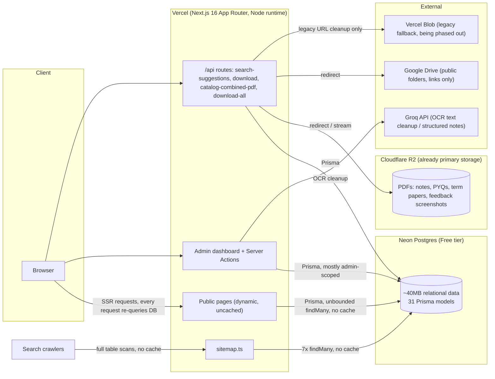

# NoteVault Infrastructure Audit

**Date:** 2026-08-06
**Branch:** `infrastructure/backend-migration`
**Scope:** Audit only — no code, schema, data, or infrastructure was changed.
**Production:** https://www.dupyq.online (Vercel)
**Trigger:** Neon Free tier exceeded its monthly network-transfer allowance. Database size ≈ 40MB; transfer ≈ 7GB/month.

---

## 1. Executive Summary

NoteVault is a Next.js 16 (App Router) + Prisma 6 + TypeScript app deployed on Vercel, backed by Neon Postgres, with file storage already migrated to Cloudflare R2 (Vercel Blob is kept only as a legacy read fallback). Authentication is a custom JWT/bcrypt system (not NextAuth), and authorization is consistently enforced via a `requireAdmin()` guard in every admin Server Action and an auth check in the admin layout — no missing server-side authorization was found.

The database-transfer problem is **not** caused by large data volume (40MB is trivial) — it is caused by **query pattern**, specifically:

1. Several high-traffic public pages (`/subjects/[id]`, `/pyq-notes`, and by extension `/pyq-notes/[id]`, `/terms/[id]`) call **`getUnifiedPyqArchive()`**, a function that merges three unbounded `findMany()` queries (`catalogPaperUpload`, `resource` with nested `subject/term/program`, and `driveFileMatch` with nested `driveSubject`/`link.session`) — **with no `take` limit, no `select` narrowing beyond nested relations, and no caching** — on **every single request**, because none of these pages declare `export const revalidate` or `export const dynamic = "force-static"`.
2. `src/app/sitemap.ts` performs 7 more full-table `findMany()` calls with no `revalidate` export, so every crawler hit (Googlebot, Bingbot, etc.) re-runs full table scans across `program`, `term`, `subject`, `resource`, `examSession`, `sessionProgramLink`, and `driveFileMatch`.
3. `generateMetadata()` on dynamic pages independently re-fetches the same records the page component fetches, doubling DB round-trips per request.

None of this is a Neon-specific problem — moving to Supabase Postgres without fixing the query/caching pattern will reproduce the same egress blowout there. **Phase 2 should fix caching before or during the backend swap**, not after.

Storage is already properly separated from the database (R2/Drive links only, no BLOBs in Postgres), which significantly simplifies the migration — the R2 leg of "Supabase + R2" is largely already done.

---

## 2. Current Architecture

---

## 3. Application & Dependency Inventory

| Item | Value |
|---|---|
| Next.js | 16.2.10 (App Router only, no Pages Router) |
| React | 19.2.4 |
| TypeScript | ^5, strict mode, `target: ES2017`, path alias `@/* → ./src/*` |
| Prisma | 6.19.3 (`@prisma/client` 6.19.3), custom generated client output at `src/generated/prisma` |
| Package manager | npm (`package-lock.json`) |
| Node engines | Not pinned in `package.json` |
| Build/dev scripts | `dev: next dev`, `build: next build`, `start: next start`, `postinstall: prisma generate`, `test: node --import tsx --test src/lib/__tests__/*.test.ts` |
| Vercel config | No `vercel.json` present; deployment via `.vercel/` project link |
| Middleware | **None** — no `middleware.ts` anywhere in the repo |
| Server Actions | 6 files: `src/lib/actions.ts` (~2,700 lines, ~150 exported actions), `student-actions.ts`, `consolidated-match-actions.ts`, `subject-analysis-actions.ts`, `ai.ts`, `admin/(dashboard)/subject-normalization/actions.ts` |
| API route handlers | 4: `/api/search-suggestions`, `/api/catalog-combined-pdf`, `/api/download/[resourceId]`, `/api/subjects/[id]/download-all` |
| Cron / scheduled jobs | **None** (no `vercel.json` crons, no cron/queue packages) |
| Background jobs / queues | **None** (no BullMQ, Inngest, Trigger.dev) |
| File-system writes | `src/lib/storage.ts:106` — local dev-only fallback (`writeFile` to `public/uploads/...`) when R2 and Blob are both unconfigured |
| Edge runtime | **Not used anywhere** |
| Node runtime | Explicit in `/api/catalog-combined-pdf/route.ts` (`export const runtime = "nodejs"`, required for `pdf-lib`) |
| AI provider | Groq (`groq-sdk`), model `openai/gpt-oss-120b` (overridable via `GROQ_MODEL`); `@anthropic-ai/sdk` present in `package.json` but unused |
| Auth | Custom JWT (httpOnly cookie, 7-day expiry) + bcryptjs, **not** NextAuth/Auth.js |

---

## 4. Environment Variables (names only — no values inspected or printed)

**Referenced in code:**
`DATABASE_URL`, `DATABASE_URL_UNPOOLED`, `JWT_SECRET`, `ADMIN_SEED_EMAIL`, `ADMIN_SEED_PASSWORD`, `BLOB_READ_WRITE_TOKEN`, `R2_ACCESS_KEY_ID`, `R2_SECRET_ACCESS_KEY`, `R2_ENDPOINT`, `R2_BUCKET_NAME`, `R2_PUBLIC_URL`, `GOOGLE_DRIVE_API_KEY`, `GROQ_API_KEY`, `GROQ_MODEL`, `OPENAI_API_KEY` (unused), `OPENAI_MATCH_MODEL` (unused), `OCR_PYQ_ROOT`.

**Present in `.env` (local, gitignored):** `ADMIN_SEED_EMAIL`, `ADMIN_SEED_PASSWORD`, `BLOB_READ_WRITE_TOKEN`, `DATABASE_URL`, `DATABASE_URL_UNPOOLED`, `JWT_SECRET`, `R2_ACCESS_KEY_ID`, `R2_ACCOUNT_ID`, `R2_BUCKET_NAME`, `R2_ENDPOINT`, `R2_PUBLIC_URL`, `R2_SECRET_ACCESS_KEY`.

**Additional names present in `.env.local` (local, gitignored):** `GOOGLE_DRIVE_API_KEY`, `GROQ_API_KEY`, `NEON_AUTH_BASE_URL`, `NEON_PROJECT_ID`, `NEXT_PUBLIC_SITE_URL`, `PGDATABASE`, `PGHOST`, `PGHOST_UNPOOLED`, `PGPASSWORD`, `POSTGRES_DATABASE`, `POSTGRES_HOST`, `POSTGRES_PASSWORD`, `POSTGRES_PRISMA_URL`, `POSTGRES_URL`, `POSTGRES_URL_NO_SSL`, `POSTGRES_URL_NON_POOLING`, `POSTGRES_USER`.

Both `.env` and `.env.local` are correctly gitignored. No secret values were read or printed during this audit.

---

## 5. Prisma Model & Relationship Summary

31 models, all actively queried (none unused). Full field-level detail lives in `prisma/schema.prisma`; key structure:

- **Catalog hierarchy:** `Program → Term → Subject → Resource` (PYQ/Notes), with `Subject` self-relations for `parentSubject`/`mergedInto` (subject de-duplication) and a `SubjectAlias` table for name normalization.
- **Drive-linked archive:** `ExamSession → SessionProgramLink → DriveFileMatch`, plus `DriveSubject` mapping Drive-derived subject names onto canonical `Subject` rows.
- **Content:** `SubjectNotes`, `NoteTheme`/`NoteThemeVersion`, `SubjectAnalysis`, `Question`, `ContentBlock`.
- **Admin/ops:** `Admin`, `FailedUpload`, `UploadBatch`, `CatalogPaperUpload`, `CatalogSubjectOverride`, `ScanRun`, `SubjectMergeSuggestion`, `SubjectMergeLog`, `SubjectMatchMemory`, `CourseMatchMemory`.
- **Student/gamification:** `Student`, `StudentExamDate`, `OrangeEvent`.
- **Misc:** `SiteSettings` (singleton), `Feedback`.

**Notable unique constraints/indexes:** `Program.slug` unique; `Subject @@unique([termId, slug])`; `Resource @@index([fileHash])` (dedup); `CatalogPaperUpload.fileHash` unique; `DriveFileMatch @@unique([linkId, driveFileId])`.

**Large-payload fields (contribute disproportionately to transfer per row):** `Resource.ocrText` (`@db.Text`, unbounded), `Question.rawOcrText` (`@db.Text`), `SubjectAnalysis.compiledNotes`/`mostRepeatedJson`/`predictedPaperJson`, `SubjectNotes.content`/`structuredJson`, `NoteTheme.draftJson`/`publishedJson`, `NoteThemeVersion.snapshotJson`. None of the audited "archive index" queries (`getPyqArchiveIndex`, `getFullDriveArchiveIndex`) select `ocrText`, so the unbounded-row-count problem (item 6) is the primary driver, not per-row payload size — but any endpoint that *does* pull `ocrText`/`rawOcrText` across many rows would compound it.

**Migration history:** 21 migrations from `20260717185316_init_postgres` through `20260806100000_add_subject_normalization`, consistent with active development, no destructive/rollback anomalies observed.

**Seed scripts:** `prisma/seed.ts` + 9 topic-specific seeders (`seed-du-syllabus.ts`, `seed-biochemistry.ts`, `seed-course-match-memory.ts`, `seed-historical-exam-sessions.ts`, `seed-note-themes.ts`, `seed-demo-content-blocks.ts`, `seed-bcom-*.ts`, `seed-elective-pools.ts`) — all write hardcoded/in-repo data, safe to re-run (upsert-based).

---

## 6. Query Inventory Summary

Full per-call detail in `docs/QUERY_INVENTORY.csv` (57 rows covering the highest-risk and representative call sites out of ~257 total Prisma call sites found across the repo).

**Distribution across all 257 call sites:** findMany 89, findUnique/findUniqueOrThrow 52, findFirst 18, create 44, update 39, updateMany 5, delete 20, deleteMany 2, upsert 17, count 16, aggregate 3, groupBy 1, `$transaction` 5. **Zero `$queryRaw`/`$executeRaw` usage** — everything goes through Prisma's typed API, which simplifies a Supabase port (no raw-SQL Postgres-dialect coupling to worry about).

**Confirmed properly paginated/bounded (Low risk):** `getRecentResources` (take 6), `getLeaderboard` (take 20), `getUpcomingExamDates` (take 5), `getSuggestions` (take 200 — still worth tightening), `getScanRuns` (take 10), `getRecentMergeLogs` (take 20).

**Confirmed unbounded public-facing `findMany()` (no `take`, no cache):** `getProgramsByLevel`, `getPyqArchiveIndex`, `getFullDriveArchiveIndex`, `searchSubjects` (+ its alias sub-query), all 7 sitemap queries.

---

## 7. Excessive Network-Transfer Diagnosis

| Rank | Cause | Severity | Evidence |
|---|---|---|---|
| 1 | **`getUnifiedPyqArchive()`** merges 3 unbounded `findMany()` calls (`catalogPaperUpload`, `resource` w/ nested subject→term→program, `driveFileMatch` w/ nested driveSubject + link→session) and is called fresh, uncached, on **every** `/subjects/[id]` and `/pyq-notes` request | **Critical** | `src/lib/pyq-catalog.ts:225-316`, `src/app/(site)/subjects/[id]/page.tsx:72`, `src/app/(site)/pyq-notes/page.tsx:22`; none of these pages set `revalidate`/`dynamic`; not wrapped in React `cache()` |
| 2 | **No caching/ISR on dynamic public pages** (`subjects/[id]`, `pyq-notes/[id]`, `terms/[id]`) — every visitor triggers full SSR + fresh Prisma round-trips | **Critical** | Confirmed absence of `export const revalidate` / `export const dynamic` in these page files (contrast with `programs/[slug]/page.tsx`, which correctly has `dynamic = "force-static"`) |
| 3 | **`sitemap.ts` full-table-scans 7 models on every generation**, no `revalidate` export — search-engine crawlers (which hit sitemaps frequently and predictably) repeatedly trigger full scans of `program`, `term`, `subject`, `resource`, `examSession`, `sessionProgramLink`, `driveFileMatch` | **High** | `src/app/sitemap.ts:34-50` |
| 4 | **Duplicate queries between `generateMetadata()` and the page component** on the same dynamic routes — each request fetches the same record twice | **Medium-High** | `src/app/(site)/subjects/[id]/page.tsx` (metadata calls `getSubjectById`, page body calls it again); same pattern in `pyq-notes/[id]/page.tsx` |
| 5 | **Deep nested `include`s with no `select` narrowing** inflate per-row payload beyond what pages render — `getSubjectById` includes `resources`, `questions`, `analysis`, `notes`, `driveSubjects.files` for every subject page hit; `getCourseCoverageData` similarly nests resources+files per program | **High** | `src/lib/data.ts:188`, `src/lib/coverage-data.ts:47` |

**Ruled out / not found:**
- No PDFs, base64, or binary blobs stored in or returned from Postgres — storage is R2/Drive-link-based only.
- No polling (`setInterval`, SWR/react-query refresh intervals).
- Search typeahead (`search-bar.tsx`) is correctly debounced (200ms) — not a contributor.
- No `$queryRaw`/raw pg client usage to audit for injection/inefficiency.
- Preview-deployment-shares-prod-DB risk could not be fully ruled out from repo inspection alone (Vercel env-var scoping isn't visible in code) — **flagged as a Phase 2 prerequisite to check in the Vercel dashboard.**

**Bottom line:** a single popular subject page or a crawler indexing the whole `/subjects/*` and `/pyq-notes/*` surface, multiplied by zero caching, is entirely sufficient to turn 40MB of source data into several GB/month of egress. This is fixable with caching/`select` narrowing independent of which Postgres provider is used — **recommend applying it before or during the Supabase cutover**, since otherwise the same problem reproduces on Supabase's own egress-metered free tier.

---

## 8. Authentication & Authorization Audit

- **Library:** Custom JWT (httpOnly cookie, 7-day expiry) + bcryptjs (10 rounds). Not NextAuth/Auth.js/Clerk.
- **Provider:** Credentials only (email + password), single `Admin` model, no role/permission hierarchy — all admins are equal.
- **Route protection:** `src/app/admin/(dashboard)/layout.tsx:40-44` redirects to `/login` for any unauthenticated session, covering all nested admin routes.
- **Server Action protection:** A `requireAdmin()` helper (`src/lib/actions.ts:43-49`, duplicated identically in `subject-normalization/actions.ts:11-15`) throws `"Unauthorized"` if no session exists. **Confirmed called at the top of all ~150 admin-mutating Server Actions**; only `loginAction`/`logoutAction` correctly omit it.
- **API routes:** all 4 API routes are intentionally public/unauthenticated (search suggestions, download redirect, combined-PDF, bulk-download) — no admin-only logic is exposed via REST, so this is by design, not an oversight.
- **No missing server-side authorization was found.** The one soft gap: several admin sub-routes referenced in the admin nav (e.g. `/admin/programs`, `/admin/bulk-upload`, `/admin/coverage`, etc.) render under the shared `admin/(dashboard)/layout.tsx`, which already gates them — but this audit did not exhaustively verify every nested page file individually beyond confirming the layout-level guard applies to the whole segment.

---

## 9. Storage & File Inventory

**Already migrated off Postgres and mostly off Vercel:**
- **Primary storage: Cloudflare R2** (`src/lib/storage.ts`), via `@aws-sdk/client-s3`, using pre-signed direct-upload URLs (15-min expiry) for browser→R2 uploads.
- **Legacy fallback: Vercel Blob** (`@vercel/blob`) — kept only to serve/delete files uploaded before the R2 migration; no new writes.
- **Local filesystem** — dev-only fallback to `public/uploads/...` when neither R2 nor Blob is configured.
- **Google Drive** — read-only, API-key auth, public folders only; NoteVault stores only `driveFileId`/`webViewLink`/`fileName` metadata, never downloads/stores the PDF bytes server-side (except transiently when merging PDFs for `/api/catalog-combined-pdf`).
- **No BLOB/Bytes columns for file content anywhere in `prisma/schema.prisma`** — every file reference is a URL string (`Resource.fileUrl`, `TermPaper.fileUrl`, `CatalogPaperUpload.fileUrl`, `FailedUpload.fileUrl`, `SiteSettings.heroImageUrl`/`currencyIconUrl`).

**Upload validation:** filename sanitization + random UUID prefix (good); SHA-256 `fileHash` dedup on `Resource`/`TermPaper`/`CatalogPaperUpload`/`FailedUpload` (good). **Gap:** no MIME-type validation and no explicit file-size limit enforced in `saveUploadedFile()`/`putBytes()` — relies on admin trust since uploads are admin-gated.

**Files that would move to R2 in a fuller migration:** none remain — R2 migration for file storage is effectively **already done**. Only the legacy Vercel Blob URLs need eventual cleanup/redirect once confirmed unused.

---

## 10. Source-Data Inventory

| Path | Format | Approx. size / records | Notes |
|---|---|---|---|
| `254-pending-files-for-organization.csv` | CSV | 23.8KB, 227 rows | Unclassified scanned PDFs awaiting subject assignment; non-sensitive |
| `docs/seo/backlink-tracker-template.csv` | CSV | template | Not production data |
| `prisma/migration-export.json` | JSON | full catalog export | Programs/Terms/Subjects/Resources; no credentials/PII |
| `scratch/bcom_drive_files.json` | JSON | 52KB, ~465 records | Google Drive file listings (public links), non-sensitive |
| `scratch/bcom_all_drive_pdfs.json` | JSON | 53KB | Extended Drive PDF catalogue, non-sensitive |
| `scratch/index.json`, `scratch/split_index.json` | JSON | 85KB each | Derived search-index cache, non-sensitive |
| `scratch/search-index.json` | JSON | 35KB | Typeahead index, non-sensitive |
| `src/data/archive-official-map.json` | JSON | catalog mapping | Non-sensitive |
| `src/data/ramanujan-pyq-catalog.json` | JSON | catalog | Non-sensitive |

**No XLSX/XLS files found.** **No sensitive data (credentials/PII) found in any committed data file.**

**Import/seed scripts:** `prisma/import-core-pyqs.ts` (reads local `/Desktop/OCR PYQ` folder → `Resource`), `prisma/sync-all-drive-links.ts` (Google Drive API → `DriveFileMatch`, metadata only), `prisma/link-drive-subjects-to-catalog.ts` (matches `DriveSubject` → `Subject`), plus ~10 more topic-specific seed/import scripts, all upsert-based and re-runnable.

---

## 11. Data Classification

| Class | Examples | Current location |
|---|---|---|
| A. PostgreSQL relational data | Programs, Terms, Subjects, Resources (metadata), Questions, Admins, Students, Feedback, all mapping/alias tables | Neon (→ Supabase in Phase 2) |
| B. R2 public storage | PYQ PDFs, Notes PDFs, term-paper bundles | Cloudflare R2 (already done) |
| C. R2 private storage | Failed-upload retries, feedback screenshots | Cloudflare R2 (already done, same bucket — no separate private bucket currently) |
| D. Generated/cacheable data | Unified PYQ archive index, sitemap data, programme/subject navigation, catalog search index | **Currently computed fresh from Postgres on every request — this is the core problem** |
| E. Analytics-type data that shouldn't live in the app DB | `Resource.downloads` counter, `OrangeEvent`/gamification events | Currently in Postgres; low volume, not itself a transfer risk, but worth reconsidering long-term |
| F. Obsolete/duplicated/unnecessary | `scratch/*.json` index files (superseded by DB), legacy Vercel Blob references, `OPENAI_API_KEY`/`OPENAI_MATCH_MODEL` (unused since Groq switch) | Repo/env cleanup candidates |

---

## 12. Neon Dependencies

- Provider in `prisma/schema.prisma`: `postgresql`, standard `DATABASE_URL` (pooled/pgbouncer) + `DATABASE_URL_UNPOOLED` (direct, migrations only) — **no Neon-proprietary driver** (`@neondatabase/serverless` is not a dependency).
- No raw `pg`/`postgres` client, no `$queryRaw`/`$executeRaw` — 100% Prisma Client API.
- `.env.local` contains Neon-specific extras (`NEON_AUTH_BASE_URL`, `NEON_PROJECT_ID`, `PG*`/`POSTGRES_*` variants) that appear to be auto-injected by the Vercel–Neon integration rather than hand-written — these will simply become unused once DATABASE_URL points at Supabase.
- **Conclusion: minimal Neon lock-in.** Because everything routes through standard Prisma + standard `postgresql://` connection strings, swapping `DATABASE_URL`/`DATABASE_URL_UNPOOLED` to Supabase should be a connection-string change, not a code change — contingent on fixing the caching issue first so the same problem doesn't reproduce.

---

## 13. Vercel Dependencies

- `@vercel/blob` — legacy-only, low coupling, easy to remove once old URLs are migrated/confirmed dead.
- No `@vercel/kv`, `@vercel/postgres`, `@vercel/analytics`, `@vercel/og`, or Vercel Cron usage.
- No `vercel.json` — deployment config is default/dashboard-managed.
- No Edge Runtime usage (avoids Edge-specific portability issues).
- One Node-runtime-specific route (`catalog-combined-pdf`, uses `pdf-lib` + Node `fetch`) — should be fine on any Node-capable host.

---

## 14. Hosting Portability

| Target | Risk |
|---|---|
| **Cloudflare Workers + OpenNext** | Medium — Node-runtime route (`pdf-lib` based PDF merging) and local-filesystem fallback (`fs.writeFile`) would need adjustment; OpenNext supports Node-compat mode but PDF-lib's memory use under Workers limits needs testing |
| **Netlify** | Low — standard Next.js App Router support; no Vercel-proprietary APIs beyond legacy `@vercel/blob` (removable) |
| **Railway** (persistent Node server) | Low — simplest target; native Node runtime, no serverless constraints on the PDF-merge route |
| **Standard Node.js hosting** | Low — same as Railway |

No code changes were made; this is a compatibility read, not an implementation.

---

## 15. Security Risks

1. No MIME-type validation on file uploads (admin-only surface, so limited blast radius, but worth adding before any external upload path is exposed).
2. No explicit file-size cap enforced server-side in `saveUploadedFile()` (Server Actions body limit is set to 25MB in `next.config.ts`, which provides an outer bound).
3. Single flat `Admin` role — no least-privilege separation between admins (acceptable at current team size, worth flagging for growth).
4. `.env.local` carries a wide set of Neon/Postgres connection-string variants (`PG*`, `POSTGRES_*`) beyond what the app actually reads — larger secret surface than necessary; worth pruning during the Supabase cutover.

## 16. Performance Risks

1. Unbounded `findMany()` on `getPyqArchiveIndex`, `getFullDriveArchiveIndex`, `searchSubjects`, and all 7 sitemap queries — will only get worse as the archive grows.
2. No caching layer (`revalidate`, `dynamic = "force-static"`, or React `cache()`) on the highest-traffic public pages.
3. Duplicate queries between `generateMetadata()` and page bodies on dynamic routes.
4. `getDailyQuestion` uses a `count` + `skip` modulo-rotation pattern with no supporting index — full scan risk as `Question` grows.

## 17. Data-Loss Risks

1. None of the source-data files (`scratch/*.json`, CSVs) are the authoritative record — Postgres is authoritative; losing `scratch/` would not lose product data, only convenience caches.
2. Google Drive-linked files are external dependencies outside NoteVault's control — if a Drive folder's sharing permissions change, `DriveFileMatch` rows become stale/broken links; no local backup of that PDF content exists.
3. No backup/export step is currently visible in the repo for the Neon database itself (standard Neon/Supabase point-in-time recovery would need to be confirmed as configured, not assumed).

## 18. Recommended Migration Sequence

1. **Fix the caching/query problem first, on the current Neon database**, to confirm it actually resolves the egress issue before spending migration effort — add `revalidate`/`select` narrowing to the 5 items in §7, wrap `getUnifiedPyqArchive()` and friends in React `cache()`, add `revalidate` to `sitemap.ts`. This is cheap, reversible, and de-risks the rest.
2. Provision Supabase Postgres (schema-only, via `prisma migrate deploy` against the new `DIRECT_URL`), verify all 21 migrations apply cleanly.
3. Do a data export/import pass (`pg_dump`/`pg_restore` or Prisma-based seed replay) from Neon → Supabase, validate row counts per model against the current Neon instance.
4. Point a **preview** Vercel deployment at the new Supabase `DATABASE_URL`/`DIRECT_URL`, smoke-test all admin flows and public pages.
5. Only after preview validation, cut production `DATABASE_URL` over; keep Neon read-only/untouched for a rollback window.
6. Decommission Neon once Supabase has run cleanly in production for an agreed monitoring period.

R2 storage requires no migration — it's already the primary file store.

## 19. Exact Phase 2 Prerequisites (information/access needed from you)

1. **Supabase project** — project URL + pooled/direct connection strings (or invite me as a collaborator to create one).
2. **Confirmation of current Vercel env var scoping** — specifically whether Preview/Development deployments currently share the same `DATABASE_URL` as Production (this repo audit couldn't see Vercel's env-var dashboard; if previews share prod, that's a likely contributor to the transfer spike and needs fixing regardless of provider).
3. **Neon dashboard access or a usage/egress breakdown export** (if available) — to correlate the 7GB figure against timestamps and cross-check against the query culprits identified in §7, rather than relying on code inference alone.
4. **Decision on `Admin` role model** — whether Phase 2 should also introduce role tiers, or keep the current flat-admin model.
5. **Confirmation this audit's branch/PR is the right place to stage Phase 2 work**, or whether you want a fresh branch per migration step.

---

*No application logic, schema, migrations, environment variables, DNS, or deployments were modified in the course of this audit.*
