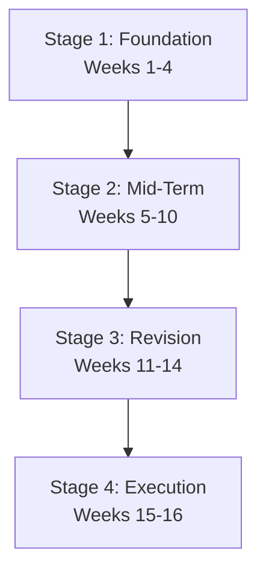

Delhi University operates on a fast-paced semester system. Each semester lasts approximately 15 to 16 weeks, which goes by quickly amidst college festivals, society audits, and internal assessments. Many students delay preparation until the final week, resulting in unnecessary stress and lower grades.

To score a high SGPA without cramming, structure your studies around a regular semester timeline. 

This guide outlines a week-by-week plan to help you stay ahead of your course requirements.

---

## The 4-Stage Semester Timeline

A typical 16-week academic semester can be divided into four distinct preparation stages:

---

## Stage 1: The Foundation (Weeks 1 to 4)
* **Focus:** Resource gathering and conceptual familiarity.
* **Tasks:**
  - Attend introductory lectures to understand the course structure and marking schemes.
  - Gather recommended readings, standard textbooks, and past exam papers.
  - Review the syllabus structure. Check out the [program browser](https://www.dupyq.online/browse/college) to confirm which papers apply to your semester.
* **Prep Hack:** Download the previous three years of [question papers from the PYQ archive](https://www.dupyq.online/pyq-notes) now. Keep them in a folder to help guide your reading throughout the semester.

---

## Stage 2: The Mid-Term Push (Weeks 5 to 10)
* **Focus:** Internal assessments, practicals, and conceptual depth.
* **Tasks:**
  - Submit mid-semester projects, assignments, and presentations on time to secure your internal marks.
  - Prepare for class tests by reviewing core unit concepts.
  - For science students, ensure your practical records are up to date and signed weekly by lab instructors.
* **Prep Hack:** When writing class assignments, format them like exam answers (with introductions, subheadings, and conclusions). This helps build effective answer-writing habits early.

---

## Stage 3: The Revision Cycle (Weeks 11 to 14)
* **Focus:** Active recall and past paper auditing.
* **Tasks:**
  - Complete your notes for all syllabus units.
  - Review the past papers you gathered in Stage 1. Build a topic-frequency table to identify recurring question models.
  - Transition from reading textbooks to practicing specific questions.
* **Prep Hack:** Use the [session archive](https://www.dupyq.online/exam-sessions) to see which questions have repeated over the last few cycles. Focus your revision on these high-yield topics.

---

## Stage 4: Exam Execution (Weeks 15 & 16)
* **Focus:** Timed mock tests and review.
* **Tasks:**
  - Solve at least two full previous year papers under strict 3-hour exam conditions. This helps establish your pacing.
  - Review formula sheets, chemical mechanisms, block diagrams, and key definitions.
  - Prioritize sleep. Ensure you get 7–8 hours of rest before each exam to keep your mind sharp for reasoning questions.

---

## Get Ahead of the Curve

Do not wait for the exam schedule to be released. Go directly to the [full PYQ archive](https://www.dupyq.online/pyq-notes) to find your semester's papers, or use the [exam kit tools](https://www.dupyq.online/tools/exam-kit) to build custom practice sets for quick review.
